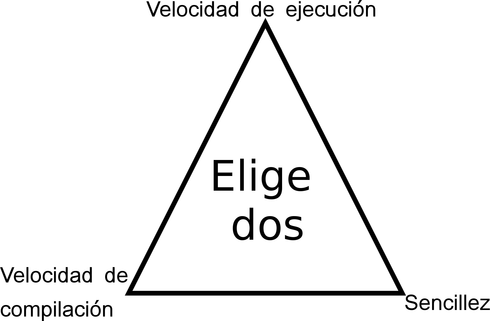

# Por qué Go

Cuando comienzas a plantearte qué lenguaje de programación deberías aprender aparecen muchas preguntas: ¿Qué me ofrece? ¿Para qué sirve? ¿Para qué se usa? ¿Realmente lo necesito? ¿Qué hace diferente a este lenguaje frente a otros?

### Un poco de Historia

Go (o Golang) es un lenguaje de programación moderno, creado en 2007 por Robert Griesemer, Rob Pike y Ken Thompson y lanzado en 2009. Trata de aprender de los errores de otros lenguajes de programación más antiguos, tomando lo mejor de cada uno y eliminando las limitaciones o problemas que estos nos presentan.

Ha sido proclamado por muchos como el "C del siglo XXI". Y cuando queremos decir C, nos referimos a su popularidad (para difícil y poco expresivo, ya tenemos el C creado por Dennis Ritchie que tanto nos ha dado). Actualmente, es utilizado por grandes empresas como Google, Adobe, Dropbox, GitHub o Netflix y las ofertas de empleo para los expertos en este lenguaje se disparan por momentos.

### Un nuevo lenguaje... ¿Para qué?
Go nace de la necesidad de crear un lenguaje donde:
* La programación no sea algo difícil
* El desarrollador no se sienta frustrado constantemente
* Elegir un lenguaje de programación a la hora de crear una herramienta no se convierta en la más complicada de las decisiones a tomar durante el proyecto
* La eficiencia del programa resultante sea suficientemente buena

En los lenguajes de programación tradicionales, era necesario escoger entre una rápida velocidad de ejecución, rápida velocidad de compilación o sencillez en la lectura y escritura del lenguaje (pudiendo escoger dos de estos elementos). En la filosofía Go, estos tres elementos son posibles al mismo tiempo.

Es un lenguaje que busca lo que ningún otro ha conseguido: eficiencia de un lenguaje compilado y la sencillez de un lenguaje de scripting.

Los lenguajes compilados son aquellos que, tras pasar por el compilador, son traducidos a lenguaje máquina. Cuando tu programa es ejecutado, no experimentarás la sobrecarga que supone "traducir" línea a línea de tu código cada vez que lo ejecutas (por no hablar de las posibles optimizaciones que puede hacer el compilador para ahorrar ciclos de instrucción). Tradicionalmente, estos lenguajes han sido más difíciles de leer y escribir que los lenguajes interpretados. Con Go podemos compilar nuestro programa mientras mantenemos la sintaxis de un lenguaje de scripting (incluso, más fácil en algunos casos). Además, gracias a que es un lenguaje compilado puedes proporcionar un ejecutable de tu programa sin dependencia alguna. De esta forma no tienes que preocuparte que aquellos que usen tu programa tengan instalada la versión X de NodeJS o si está utilizando Python 2.7 o 3.x, por ejemplo.

De forma íntimamente ligada con el párrafo anterior, se encuentra la facilidad que proporciona Go a la hora de ejecutar y compilar programas. Se abren aquí dos puntos a analizar:
* Si solo deseas ejecutarlo, se compilará en un directorio temporal y, tras finalizar, dicho ejecutable será eliminado de forma totalmente automática. De esa forma, se abstrae al programador del proceso de compilación y ejecución propios de la fase de testeo (debugging). Cuando el desarrollador desee obtener un ejecutable final, podrá hacerlo con tan solo una orden.
* Cuando deseas ejecutar en algunos lenguajes como Java o compilar en otros como C/C++, necesitas indicar las dependencias que tiene tu programa en el propio comando. Go simplifica este proceso y simplemente necesita que digamos qué queremos ejecutar o construir.

El lenguaje no es solo más rápido en ejecución que muchos lenguajes de programación modernos como Kotlin, Scala o Dart, sino que es más rápido en compilar que otros lenguajes como C o Pascal.

Por otra parte, como ya se ha dicho varias veces, es bastante sencilla. Esto es un punto a favor a la hora de escribir código ya que facilita que el desarrollo de software sea más rápido y que el código no de lugar a ambigüedad alguna. Además, sus creadores han tratado de reducir el número de palabras clave que el programador debe de recordar para trabajar de forma adecuada con el lenguaje. Pero no tenemos que olvidar que hoy día todo está en Internet y no tiene sentido alguno dar la espalda a este hecho. Por eso, la sintaxis de los lenguajes importa cada vez menos y cobra especial importancia las capacidades del lenguaje más que cómo se escribe.

Los programadores tenemos que lidiar en demasiadas ocasiones con los problemas derivados de la gestión de la memoria. Que Go traiga incorporado un recolector de basura abstrae al programador de la mayor parte de estos retos, ayudando a que el desarrollador se centre en resolver el problema y no en solucionar los que el lenguaje le causa. Cabe destacar, que en Go también existen los punteros (no te asustes todavía), pero no la aritmética de punteros: otro triunfo de este lenguaje de programación, que deja atrás la necesidad de pensar nuestras implementaciones en función de las direcciones de memoria.

### ¿Qué tipo de lenguaje es Go?
¿Qué paradigma define a Go? ¿Es orientado a objetos? ¿Es funcional? Es algo que muy probablemente te hayas preguntado a estas alturas de la película: Go es un lenguaje de programación multiparadigma. Normalmente, se suele clasificar Go como un lenguaje imperativo, concurrente y estructurado.

#### Go no es un lenguaje orientado a objetos
Aunque nos permite trabajar con cierta metodología de la programación orientada a objetos. Por ejemplo, no disponemos del concepto de "clase" o "template". Tenemos estructuras (como en C) y cuando definimos un método, no tiene por qué estar vinculado solo a solo a una estructura.

La herencia, como probablemente sepas por otros lenguajes de programación, es aquel mecanismo por el cual un objeto se basa en otro (o mejor dicho, su clase), utilizando sus mismos atributos y comportamiento (extendiendo estos). Go no dispone de herencia, pero permite la composición: creamos un objeto a partir de instancias de objetos de otros tipos que tengan los atributos y funcionalidades deseadas.

Es habitual trabajar con interfaces. En este sentido, Go tiene muy calada la idea de "Duck typing". Podemos decir que este tipo de tipificación de datos está basado en la frase de James Whitcomb: "Cuando veo un ave que camina como un pato, nada como un pato y suena como un pato, a esa ave yo la llamo pato". De esta forma, no nos preocupamos si un tipo de dato utiliza unos atributos u otros o qué métodos tiene implementados. Solo nos interesa que tenga implementados los métodos de nuestra interfaz, es decir, "si camina, nada y suena como un pato".

Todo esto quedará más claro a lo largo de los siguientes capítulos.

### Go no es un lenguaje funcional
Pero nos permite utilizar muchos mecanismos de la programación funcional. Este estilo de programación nos permite tener un código más elegante, mantenible, sencillo de entender y fácil de testear.

Trabajar de forma funcional te permite acercarte más a los diferentes pasos en la ejecución de un problema, sin tener que pensar en estado, sino directamente como funciones que se aplican a las estructuras de datos que se han elegido.

Teniendo en cuenta que el foco del desarrollo de software se centra en el cloud, es lógico que los lenguajes hayan ido evolucionando hacia un estilo que facilite la programación de aplicaciones para estos entornos. Hoy en día es difícil trabajar en entornos de cloud y similares sin tener un modelo de programación que se parezca más al funcional que a otra cosa. Otros lenguajes han ido incluyendo en su sintaxis la posibilidad de utilizar funciones lambda y otros aspectos de la programación funcional, pero Go trae todos estos aspectos desde su diseño inicial.

## *En resumen*
Go es un lenguaje que combina potencia de computación y sencillez den su aprendizaje uso. Por tanto, si conoces C, C++ o similares, te interesa por la simplicidad que te aporta. Si sabes Python, Perl/Perl/NodeJS o similar, por la potencia computacional que te aporta. Si no sabes nada, para aprender algo que realmente es útil.

Es necesario aprovechar todas estas ventajas con las que Go nos provee, utilizando Go como lo que es: un nuevo lenguaje de programación.

De la misma forma que Python no debe escribirse de la misma forma que escribirías un programa en C, tampoco debes de hacerlo en Go.
