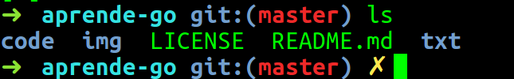

# La línea de órdenes

Mientras que en un entorno gráfico lo que ves es prácticamente lo que
hay, en la línea de órdenes las posibilidades de configurar y de
llevar a cabo órdenes es prácticamente infinita, además de
extensible. En un entorno de desarrollo es mejor aprender a manejarla
bien, ya que nos permitirá acceder a todo tipo de *scripts* y de
opciones de los mismos. Aunque es posible que se pueda trabajar desde
un entorno integrado, lo mejor es, para una bulla, poder echar mano de
la línea de órdenes.

## Qué línea de órdenes

Casi todas las distribuciones Linux modernas, e incluso Windows en su
subsistema Ubuntu y MacOS en su línea de órdenes,
trae [`bash`](https://en.wikipedia.org/wiki/Bash_(Unix_shell)). Es
suficientemente buena para la mayoría de sus objetivos. Sin embargo,
otros dos entornos, [`zsh`](https://zsh.org)
y [`fish`](https://fishshell.com), son bastante más configurables y
ofrecen una serie de facilidades para el programador que los hacen
bastante interesantes.

Para instalarlos, sigue el procedimiento habitual en tu sistema
operativo: `apt`, `yum`, `brew` o similar.

## Temas en la línea de órdenes.

Todos los shells mencionados anteriormente son *temables*, es decir,
los puedes configurar para que la línea de órdenes presente
información relativa a la rama del repositorio de código en la que
estás, versión del intérprete o compilador con el que estás
trabajando, aparte de si hay cambios en el repositorio o el directorio
en el que estás.

Aunque estos temas se pueden configurar a mano a base de cambiar el
`PROMPT`, es mejor usar aplicaciones que te permitan elegir temas que
tengan ya una combinación de colores, caracteres y líneas de estado
predeterminados. [Bash-it](https://github.com/Bash-it/bash-it) es uno
de ellos, pero también
[Oh-My-Zsh](https://github.com/robbyrussell/oh-my-zsh) para `zsh` te
proveen esta facilidad.

Por ejemplo, en la línea de órdenes anterior se muestra la rama del
repositorio en la que se está (`master`), así como, con la cruz
amarilla, el hecho de que hay cambios en el repositorio que no se han
registrado. Esto nos ayuda a conocer de un vistazo el estado del
mismo, y toda la información que presentan, como el directorio, a
navegar más fácilmente mientras estamos desarrollando. 

## Moviéndose por la línea de órdenes.

## Algunas órdenes útiles.

