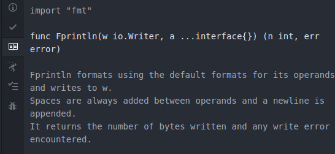
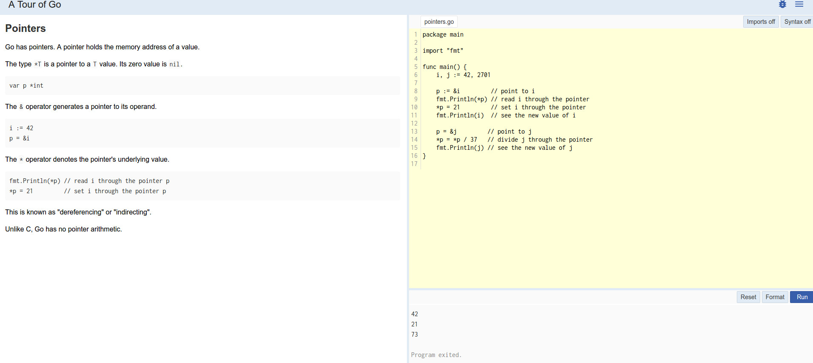

# Instala Go y comienza a trabajar
Si quieres trabajar con Go, un buen paso es descargarlo e instalarlo. Puedes descargar la última versión desde su página [oficial](https://golang.org/) para cualquiera de los sistemas operativos que está disponible. Si estás utilizando Linux (cosa más que recomendable), muy probablemente se encuentre en los repositorios oficiales de tu distribución como ```golang-go``` (aunque puede ser una versión algo antigua).

Después de instalar los binarios, debes declarar la variable de entorno ```GOPATH```. Esta variable debe apuntar al directorio que quieres que se
convierta en tu espacio de trabajo. Este espacio de trabajo es donde guardarás todos los paquetes que tú mismo escribas o que hayan sido programados por otros desarrolladores y descargados en tu máquina para poder ser utilizados. Si quieres comprobar el valor actual de esta variable, puedes ejecutar ```go env GOPATH``` desde un terminal. Es una buena idea añadir ```GOPATH/bin``` a tu variable ```PATH```.

## Go desde la línea de órdenes
Cuando descargas Python o Node puedes llamar directamente al intérprete obteniendo un REPL ("Read-Eval-Print-Loop"), es decir, una consola de lenguaje interactiva en la que puedes ir escribiendo distintas órdenes en sintaxis del lenguaje en cuestión  y obteniendo la salida. En Go, si queremos trabajar así necesitaremos descargar uno. Por ejemplo, puedes utilizar [gore](https://github.com/motemen/gore):

    $ go get -u github.com/motemen/gore

Una vez haya finalizado su descarga, podrás llamarlo escribiendo ```gore``` en tu terminal. La salida será algo similar a lo siguiente:

```bash
israel@iblancasa ➜ gore
gore version 0.2.6  :help for help
gore>
```

Puedes escribir un programa en sintaxis Golang en esa misma terminal. Por ejemplo, puedes probar a sumar dos números:
```go
gore> 1+1
2
```

## Go desde un editor de texto
Como ya se dijo en el anterior capítulo, Go es un lenguaje de programación moderno. Y, por tanto, debes utilizar herramientas modernas para trabajar con él.

Desde la primera release de Go, se han creado miles de extensiones
para IDEs (entornos integrados de desarrollo, *Integrated Development Environments*), editores de texto y similares intentando que los desarrolladores se sientan los más cómodos posibles utilizando esas herramientas. Un buen ejemplo de ello es ["go-plus"](https://atom.io/packages/go-plus) para [Atom]((https://atom.io), que muestra información sobre la instalación de Go, autocompleta utilizando ```gcode```, un formateador de código para asegurar que cumple con los estándares y mucho más.



También puedes utilizar [go-debug](https://atom.io/packages/go-debug) para encontrar los errores de tus programas escritos en Go.

## Go desde la web

También puedes utilizar Go desde un navegador. Por ejemplo, si quieres utilizar un REPL puedes acceder a [`repl.it`](https://repl.it/languages/go) y empezar a programar en Go.

Otra posible solución es utilizar un IDE en la nube, como puede
ser [`codeenv`](https://codeenv.com/) o [Cloud 9](https://c9.io), que te permite escribir código en un editor online y compartirlo con otros desarrolladores para trabajar de forma colaborativa.

La propia web oficial de Go ofrece un ["tour" para iniciarse en este lenguaje](https://tour.golang.org/), el cual dispone de un pequeño editor de texto desde el que se puede ejecutar código.


